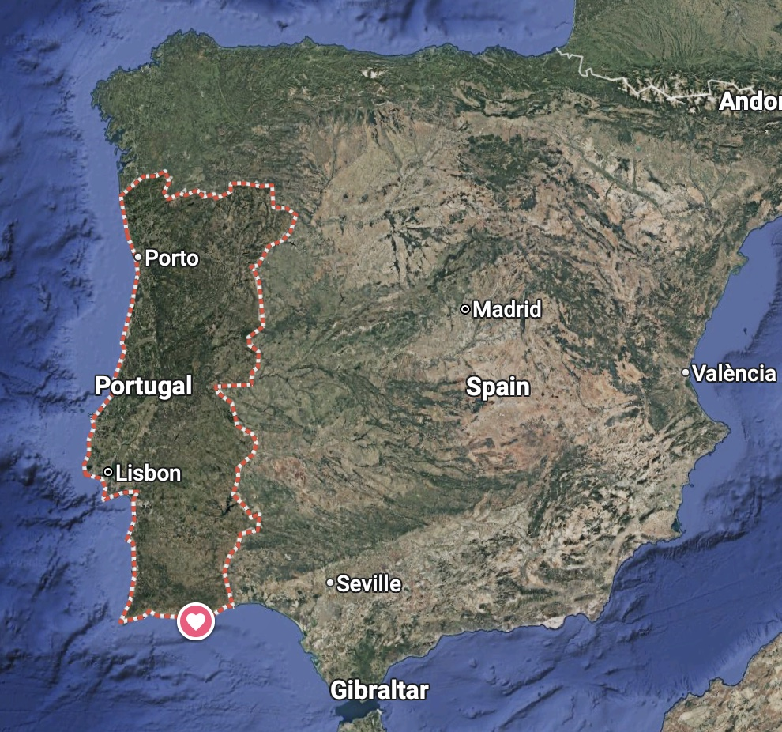
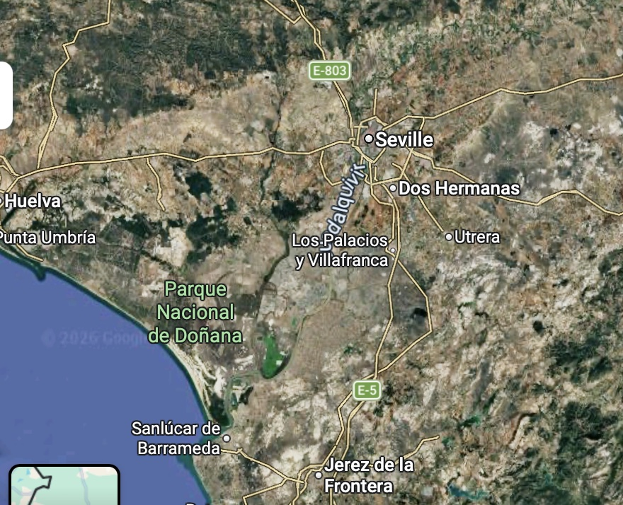
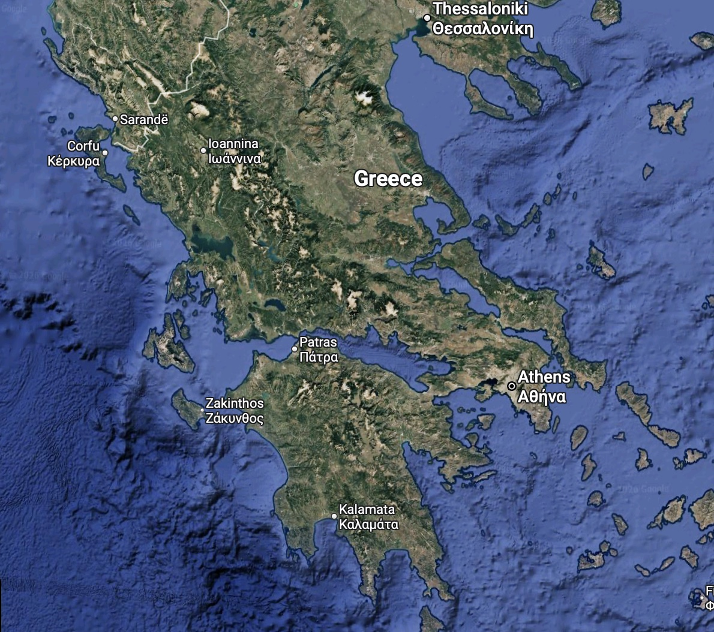
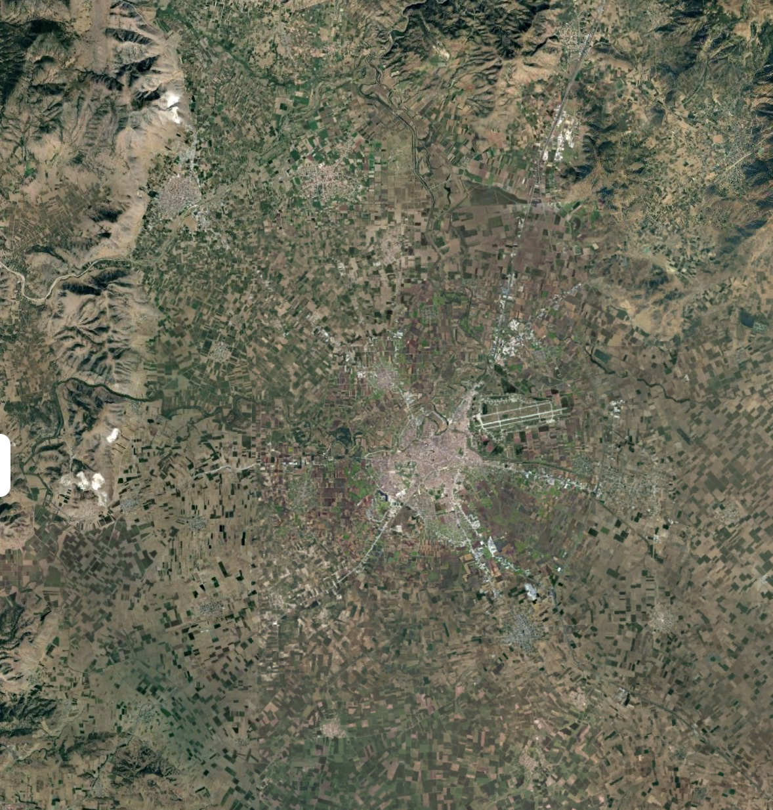

# Southern European Climate Study (SECS): Modeling Climate Stress Indicators and Livability in Seville and Larissa

A comparative climate risk analysis of two southern European cities — **Seville, Spain**
(heat and wildfire exposure) and **Larissa, Greece** (continental warming, drought, and
flood risk in the Thessaly agricultural plain, tracked as independent trends rather than
a single causal chain). The project examines how climate stress indicators evolved
from 1990–2025 and projects how they change through 2045 (and, for select indicators,
through 2100) under two emissions scenarios, using ERA5 reanalysis data, CMIP6 climate
projections, and custom-built indicators (SPI drought index, Fire Weather Index).

Capstone project for the neuefische Data Science bootcamp.

## Why these two cities

Seville and Larissa represent two distinct climate "failure modes" rather than a single
generic-warming narrative:

- **Seville** shows sustained, escalating daytime heat and fire-weather risk.
- **Larissa** demonstrates a more complex pattern of uniform warming (day and night, every
  season), alongside two separate hydrological risks tracked independently — an
  intensifying wet extreme and a drought signal that only shows up in the CMIP6
  projections, not the observed record. That historical-to-projected reversal (wetter,
  then sharply drier) points toward Larissa's mountain-flanked local geography shaping its
  precipitation story more than a simple heat-driven mechanism — arguably this project's
  most original finding (see H2 below). This project also tested a direct
  drought-primes-flood link and found none. **September 2023's Storm Daniel is the key
  historical precedent for the flood side**: 253mm in a single week, by far the record
  across the 36-year series (next-highest: 156mm, 1998) — real evidence of what Larissa's
  flood risk can produce, and the reference event the [ensemble follow-up](#future-work)
  below is aimed at resolving more precisely.

<table>
<tr>
<td width="50%">

</td>
<td width="50%">

</td>
</tr>
</table>

*Seville sits in the flat, open Guadalquivir valley, ~80km from the Atlantic — the
ocean-moderated, low-relief setting behind its narrower, daytime-only heat signature.*

<table>
<tr>
<td width="50%">

</td>
<td width="50%">

</td>
</tr>
</table>

*Larissa sits in the Thessalian plain, tightly ringed by mountains on both sides — the
continental, orographically complex setting behind both its broader heat signature and the
CMIP6 grid-resolution caveat discussed under H2.*

## Key findings

| Hypothesis | Verdict |
|---|---|
| H1 — Heat-driven fire escalation (Seville): heat ↑ → dryness ↑ → fire danger/duration ↑ | Heat leg and heat+dryness→fire leg **confirmed** (`tmax_mean` p=0.0002; heat+same-day humidity beats heat alone for FWI, ΔR²=+0.17). Longer-*duration* fires is the weakest leg — directionally up but not significant historically (p=0.129); projections show more high-danger days but no significant trend yet within the projection window |
| H2 — Larissa's continental heat signature, decoupled from a drought/precipitation trend masked by the valley's local geography | **Confirmed** — every season warming, day and night; colder winters, wider seasonal swing than Seville. *(Scoped to heat only.)* We originally expected this to compound the way it does for Seville's fire risk — heat driving the valley progressively drier, priming flash floods like Storm Daniel. It didn't: historically Larissa trends *wetter* (+51.8mm/decade) with milder drought, then CMIP6 projections reverse that entirely into extreme drought under both scenarios. That reversal, alongside Larissa's [mountain-flanked setting](#known-limitations) (terrain a ~100km model grid can't resolve), is the real discovery — local geography may be shaping Larissa's precipitation story more than any single climate driver. Flood risk (Storm Daniel) is a separate trend either way — drought→flood link tested, not supported (r=−0.05, p=0.79) |
| H3 — Divergent regional risk (cross-city) | **Best-supported hypothesis** — the two cities diverge in *character*: Seville shows a narrow, daytime-only heat signal; Larissa shows broad warming across every season, day and night, both tails |

Full reasoning and statistics behind each finding: [`documentation/Seville_Larissa_Key_Findings_vs_Hypotheses.md`](documentation/Seville_Larissa_Key_Findings_vs_Hypotheses.md)
(written under the project's original five-hypothesis structure — the table above maps
those same underlying results onto the current three-hypothesis framing in
[`documentation/project_summary.md`](documentation/project_summary.md)).
Presentation-ready walkthroughs: [`Results/Results_Summary.ipynb`](Results/Results_Summary.ipynb) (SSP5-8.5) and [`Results/Results_Summary_SSP2-4.5.ipynb`](Results/Results_Summary_SSP2-4.5.ipynb).

## Data & methodology

| Purpose | Source | Cities | Period |
|---|---|---|---|
| Historical baseline (temp, precip, wind, RH) | ERA5 reanalysis (`reanalysis-era5-single-levels`, CDS) | Both | 1990–2025 |
| Fixed reference period for percentile thresholds | Same ERA5 data | Both | 1990–2020 |
| Projections | CMIP6 (`cmcc_esm2`), SSP2-4.5 and SSP5-8.5 scenarios | Both | 2026–2045 (core), extended to 2100 for the divergence study |
| Fire danger | Custom Fire Weather Index (FWI), computed from ERA5/CMIP6 daily variables | Seville | 1990–2025 historical, 2026–2045 projected |
| Drought | Custom 3-month SPI, computed from precipitation | Both | 1990–2025 historical, 2026–2045 projected |

Percentile-based thresholds (e.g. the 90th-percentile heatwave definition) stay anchored
to the fixed 1990–2020 reference period regardless of how far the record extends, so
results stay comparable across the historical and projected periods. Two emissions
scenarios are carried through the projection work — SSP2-4.5 (moderate) and SSP5-8.5
(high) — see [`documentation/SSP_Scenario_Uncertainty_Interpretation.md`](documentation/SSP_Scenario_Uncertainty_Interpretation.md)
for how to correctly read near-term differences between them (mostly single-run model
noise, not yet a real scenario signal at this horizon).

**Honest scope note:** two cities, one climate model, illustrative of directional risk
rather than definitive climate-model consensus — see the limitations section in
[`documentation/project_summary.md`](documentation/project_summary.md).

### Known limitations

**CMIP6 grid resolution vs. Larissa's local topography.** ERA5's Larissa box is a single
tight cell (39.50–39.75°N, 22.25–22.50°E) centered on the plain. `cmcc_esm2`'s native grid
is far coarser (~0.94° × 1.25°, ~100km), so its bounding box was deliberately widened to
guarantee multiple grid points — `[40.6, 21.15, 38.6, 23.75]`, six points spanning ~100km
west (toward the Pindus foothills) to ~110km east (toward Mt. Pelion/the Aegean coast) of
the plain. The unweighted 6-point average blends the plain's own precipitation signature
with terrain ERA5 never touches. The project's bias correction (Equidistant CDF Matching,
quantile-mapped per calendar month against the 1990–2014 CMIP6/ERA5 overlap) is designed
to correct a *stable* distributional gap between the two boxes, extremes included — but
the projected Larissa drought signal (see H2 above) doesn't shrink after correction, it
deepens slightly, which points less toward "an uncorrected static offset" and more toward
a deeper issue: a ~100km grid cell can't resolve the plain's orographic precipitation
physics at all, so the model's own simulated future response over that box may not be
trustworthy for the plain specifically — a resolution limitation statistical bias
correction can't fix, since it only reshapes the output distribution, not the model's
underlying atmospheric dynamics. Worth stating explicitly wherever the projected Larissa
drought numbers are presented, alongside the "one model, no ensemble" caveat. A concrete
follow-up, not yet done: re-run the grid average using only the 1–2 CMIP6 points nearest
the plain (39.11°N or 40.05°N × 22.50°E) instead of all six, and check whether the
extreme-drought signal softens.

## Repository structure

```
Historical/                  ERA5 historical data (1990-2025) + EDA/indicator notebooks
Projected_SSP2-4.5/          CMIP6 SSP2-4.5 (moderate emissions) projections, 2026-2045
Projected_SSP5-8.5/          CMIP6 SSP5-8.5 (high emissions) projections, 2026-2045
Projected_Long_Term_2100/    Extended SSP2-4.5 vs SSP5-8.5 divergence study through 2100
Results/                     Final presentation-ready summary notebooks and figures
scripts/                     Data-pull, bias-correction, and indicator-computation scripts
documentation/                Write-ups, data references, key findings, task plans
requirements.txt
```

Each `Historical/` and `Projected_*/` folder follows the same internal layout:
`data/` (raw + processed CSV/NetCDF), `notebooks/` (EDA and indicator work), `eda_outputs/`
(derived CSVs), and `figures/` (charts) where applicable.

## Setup

```bash
python -m venv .venv
source .venv/bin/activate
pip install -r requirements.txt
```

Pulling new ERA5/CMIP6 data requires a free [Copernicus Climate Data Store](https://cds.climate.copernicus.eu/)
account and API key (`cdsapi` config in `~/.cdsapirc`); the scripts in `scripts/` handle
the fetch, bias correction, and regridding. Most analysis, however, can be reproduced
directly from the CSVs already committed in each `data/` folder without re-pulling
anything.

## Where to start

- **Results/Results_Summary.ipynb** and **Results_Summary_SSP2-4.5.ipynb** — the final,
  presentation-ready charts and numbers per city and scenario.
- **documentation/Seville_Larissa_Key_Findings_vs_Hypotheses.md** — the full statistical
  writeup behind every hypothesis and headline number above.
- **documentation/project_summary.md** — original project framing, hypotheses, and scope.
- **Historical/notebooks/** and **Projected_*/notebooks/** — the underlying EDA, indicator
  computation, and validation work.

## Future work

- **Test the grid-resolution hypothesis directly** (see [Known limitations](#known-limitations)):
  re-run the Larissa CMIP6 grid average using only the 1–2 points nearest the plain
  (39.11°N or 40.05°N × 22.50°E) instead of the full 6-point unweighted average, redo bias
  correction and SPI-3, and check whether the projected extreme-drought signal softens —
  the most direct way to separate "real projected drying" from "coarse-grid terrain
  dilution."
- **Move from a single model run to an ensemble.** Every projection in this project comes
  from one model (`cmcc_esm2`), one realization, no ensemble spread — repeating the
  SSP2-4.5/SSP5-8.5 pulls against 2-3 additional CMIP6 models would show whether Larissa's
  projected drought-category jump is a genuine multi-model signal or a `cmcc_esm2`-specific
  artifact (the grid-resolution check above and an ensemble check are complementary, not
  substitutes — resolution affects the *level*, model choice affects the *spread*). This
  matters directly for the flood side too: Storm Daniel (September 2023, 253mm in a single
  week) is the historical precedent for how extreme Larissa's precipitation signal can
  get, and one model run isn't enough to say how likely a repeat is — an ensemble is the
  right tool for resolving that precipitation signal with real confidence.
- Extend the SPI-3 drought pipeline to Seville's own projections, so both cities get a
  like-for-like historical-vs-projected drought comparison rather than only Larissa having
  one.
- Composite cross-city risk index and a third city — both explicitly cut from scope for
  time (see "What Got Cut" in `documentation/project_summary.md`) — remain natural
  extensions if the project continues past the capstone deadline.
