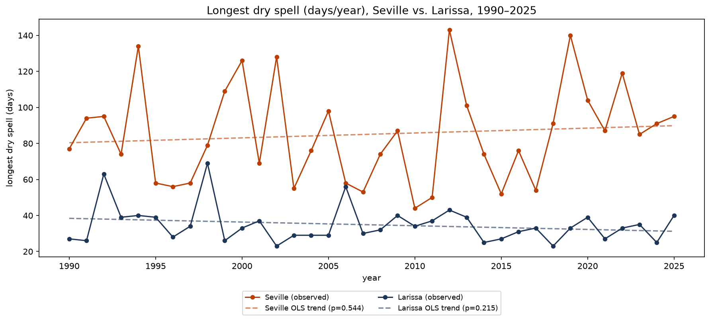
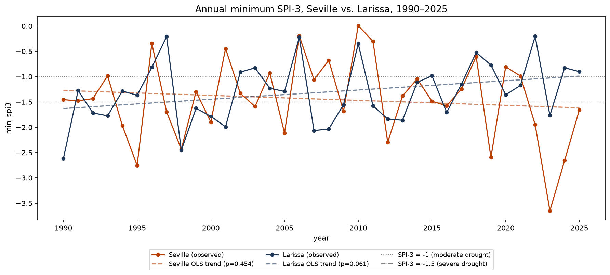

# Summary of the Historical ERA5 Findings for Seville and Larissa, and Comparison to the Old Hypotheses

Consolidates the hypothesis-independent findings from `seville_era5_eda.ipynb` and
`larissa_era5_eda.ipynb` (both 1990–2025, each notebook's own section 17), then compares them
against the five hypotheses in `project_management/project_summary.md`. All numbers are pulled
directly from each notebook's executed output.

---

## Part 1 — Key findings, Seville

### Warming is real, but distinctly asymmetric

| Metric | Slope/decade | p-value | Significant? |
|---|---|---|---|
| `tmax_mean` (daily max) | +0.38°C | **0.0002** | Yes — the strongest signal in the dataset |
| `heat_index_mean` | +0.23°C | 0.006 | Yes |
| `t2m_mean` (overall mean) | +0.22°C | 0.0062 | Yes |
| `t2m_p95` (warm tail) | +0.33°C | 0.034 | Yes |
| `tmin_mean` (daily min) | +0.04°C | 0.638 | **No — essentially flat** |
| `t2m_p05` (cold tail) | −0.04°C | 0.792 | No |
| `dpd_mean` (dewpoint depression) | +0.14°C | 0.296 | No |
| `rh_mean` | −0.29%/decade | 0.505 | No |
| `wind_mean` | ~0 | 0.975 | No |
| `precip_scaled` | −4.8 mm | 0.863 | No |

Days are getting hotter with high confidence; nights show no detectable change. This asymmetry —
not "uniform warming" — is Seville's headline finding.

### Only one season is individually significant, and it's not summer

| Season | Slope/decade | p-value |
|---|---|---|
| DJF | +0.18°C | 0.148 |
| MAM | +0.19°C | 0.231 |
| JJA | +0.18°C | 0.174 |
| **SON** | **+0.36°C** | **0.006** |

### Extreme-heat counts: significant at moderate thresholds only

| Threshold | Slope/decade | p-value |
|---|---|---|
| Days tmax≥30°C | +6.2 days | **0.003** |
| Days tmax≥33°C | +4.6 days | 0.042 (borderline) |
| Days tmax≥35°C | +3.0 days | 0.115 |
| Days tmax≥37°C / ≥40°C | +1.6 / −0.1 days | 0.164 / 0.704 |
| Heatwaves (P90, ≥3 days) | +3.9 days | **0.041** |
| Tropical nights (tmin≥20°C) | **−2.7 days** | 0.248 — wrong direction |

### Precipitation: no detectable change on any metric

Wet days (p=0.996), mean intensity (p=0.996), max 1-day (p=0.727), P95 wet-day (p=0.945), longest
dry spell (p=0.544) — all flat. 487 mm/yr scaled, CV 35%, no directional drift. Longest dry spell:
143 days (2012).

### SPI-3 (from `Calculating_SPI_for_Seville.ipynb`): a much cleaner validation than Larissa's, but a weak H2 predictor

Built to test whether a standardized drought index reveals something the flat precipitation
metrics above can't, and to give H2 a better dryness predictor than a single day's humidity.

- **Validation against the 2022–2023 Andalusia drought is unambiguous** — sharper than Larissa's
  Storm Daniel checkpoint. A sustained dip runs June–November 2022 (bottoming at −1.95 in
  November), a brief recovery in Jan–Feb 2023, then an extreme collapse to **−3.65 in April
  2023** — more severe in magnitude than Larissa's own +3.49 flood spike. 6 of 24 months in the
  window register at or below moderate-drought level.
- **As an H2 predictor, though, SPI-3 underperforms.** In the deseasonalized anomaly framing (the
  one that tests same-day relationships), it's the *weakest* of the four predictors tested:

  | Predictor | ρ vs. FWI anomaly |
  |---|---|
  | `rh_min` | −0.560 |
  | `t2m_max` | +0.402 |
  | `tp_mm` | −0.238 |
  | `spi3` | **−0.129** |

  Still significant (CI excludes zero at every framing), but this is a genuine negative result for
  the hypothesis that motivated building the notebook: 3-month accumulated dryness does not
  out-predict same-day humidity for Seville's day-to-day fire danger. Same-day conditions still
  dominate. (SPI-3's lag structure also isn't directly comparable to the other three predictors —
  it's piecewise-constant within each month, so its near-flat 14-day lag decay reflects
  month-to-month persistence rather than a genuine daily response curve.)

### Baseline-model results for four newly added indicators

`baseline_models.ipynb` originally only fit Seville's `t2m_mean`, `days tmax≥35°C`, `heatwave
days`, and `tropical nights` — none of which were the strongest trend in the project. Four more
were added based on the significance review above: `tmax_mean` and `days tmax≥30°C` (stronger and
more significant than any of the original four), `min_spi3` (Seville's own drought-depth series,
built specifically to enable direct comparison with Larissa's), and `longest_high_run` (the
strongest fire-danger trend in `seville_fire_eda.ipynb`, closing the gap that no fire indicator was
baseline-tested despite H2 being a named Seville hypothesis).

| Indicator | Best model | MAE (naive → best) |
|---|---|---|
| `tmax_mean` | `mean_last_10yr` | 0.498 → 0.386 |
| `days tmax≥30°C` | `naive_full_mean` (nothing beats it) | — |
| `min_spi3` | `ols_last_15yr` | 0.932 → 0.901 |
| `longest_high_run` | `mean_last_10yr` | 16.8 → 14.9 |

Seville now has 8 baseline-tested indicators total, alongside Larissa's 4 — 12 in the combined
comparison chart.

### Other findings

- Heat index sits **below** air temperature above 30°C (mean −0.35°C) — dry heat, not
  humidity-amplified. Jun–Aug rainfall is only 12 mm (3% of the annual total).
- Decadal step-up: 18.58°C (1990s) → 18.93 → 19.03 → 19.22°C (2020s, 6 years so far) — a real,
  monotonic shift even where individual trend tests are noisy.
- Prevailing wind: SW in spring/summer/autumn, NE in winter; no trend in wind speed.
- Grid points nearly interchangeable for temperature (r=0.995), less so for precipitation (r=0.834).
- Data integrity: 210,384 rows, zero missing values, zero duplicates, gap-free 6-hourly grid.

---

## Part 2 — Key findings, Larissa

### Warming here is far more comprehensive — day, night, and every season

| Metric | Slope/decade | p-value | Significant? |
|---|---|---|---|
| `t2m_mean` | **+0.50°C** | **<0.0001** | Yes — more than double Seville's rate |
| `tmax_mean` | +0.63°C | <0.0001 | Yes |
| `tmin_mean` | **+0.42°C** | **<0.0001** | **Yes — unlike Seville, nights are warming too** |
| `t2m_p95` (warm tail) | +0.65°C | <0.0001 | Yes |
| `t2m_p05` (cold tail) | +0.45°C | 0.0124 | Yes — unlike Seville's flat cold tail |
| `rh_mean` | −0.99%/decade | 0.0096 | Yes — significant drying of humidity |
| `dpd_mean` | +0.32°C | 0.0033 | Yes |
| `wind_mean` | +0.010 m/s | 0.289 | No |
| `precip_scaled` | **+51.8 mm** | **0.0071** | **Yes — annual rainfall is increasing** |

All four seasons individually significant (DJF p=0.001, MAM p=0.004, JJA p<0.0001, SON p=0.003) —
a stark contrast to Seville, where only autumn cleared significance.

### Extreme-heat counts: significant at every threshold tested

| Threshold | Slope/decade | p-value |
|---|---|---|
| Days tmax≥30°C | +8.4 days | <0.0001 |
| Days tmax≥33°C | +10.0 days | <0.0001 |
| Days tmax≥35°C | +6.2 days | <0.0001 |
| Days tmax≥37°C | +3.1 days | 0.001 |
| Days tmax≥40°C | +0.7 days | 0.040 |
| Heatwaves (P90, ≥3 days) | +8.6 days | <0.0001 |
| **Tropical nights (tmin≥20°C)** | **+8.3 days** | **<0.0001** |

Every single threshold is significant — including tropical nights, the exact indicator that fails
for Seville. 163 heatwave events total; longest 15 days (2024-07-08); hottest sampled day 43.3°C
(2023-07-23).

### Precipitation is intensifying, not drying — a mixed but leaning-wetter picture

| Metric | OLS p | Kendall τ p |
|---|---|---|
| Wet days/year | 0.100 | **0.034** |
| Mean wet-day intensity | 0.050 | 0.108 |
| Max 1-day rainfall | **0.040** | 0.182 |
| P95 wet-day amount | 0.070 | 0.134 |
| Longest dry spell | 0.215 (slope **−2.05**/decade) | 0.682 |

The two significance tests disagree on which specific metric clears the bar, but none point toward
drying — annual total precipitation is up significantly, and the longest-dry-spell point estimate
trends toward *shorter* dry spells, not longer. Longest dry spell on record: 69 days (1998).

### The SPI-3 / volatility findings (from `Calculating_SPI_for_Larissa.ipynb` + section 10.4)

- `min_spi3` (drought depth): **+0.183/decade, p=0.061** — droughts trending *milder*, not more
  severe (wrong direction for a drought-worsening story, though not itself significant).
- `max_week_precip_mm` (flood intensity): **+12.6 mm/decade, OLS p=0.055, Kendall τ p=0.021** —
  genuinely significant by the outlier-robust test.
- September 2023 (Storm Daniel): SPI-3 = **+3.49**, an extreme, unambiguous wet outlier. But the
  months leading into it were only mildly dry (min −0.94, April 2023) and had already recovered to
  wet (+0.84 to +1.68) by May–August — **no severe antecedent drought preceded the flood.**
- Implementation sanity check passed exactly: SPI-3 over its 1990–2020 reference period has mean
  0.000, std 1.001.

### Other findings

- Decadal step-up, even stronger than Seville's: 15.02°C (1990s) → 15.38 → 15.98 → 16.32°C (2020s).
- Heat index sits below air temperature above 30°C (mean −0.7°C) — also a dry-heat signature.
- Grid points near-interchangeable for temperature (r=0.992), less so for precipitation (r=0.728).
- Data integrity: 210,384 rows, zero missing values, zero duplicates, gap-free 6-hourly grid.
- One open item: raw annual precipitation (619 mm/yr scaled) sits above the ~400–450 mm/yr regional
  normal cited in the notebook — an unresolved discrepancy, not yet validated against an
  independent source (see `larissa_era5_eda.ipynb` section 3.2).

---

## Part 3 — Hypothesis comparison

### H1 — Heat escalation (Seville): *"Heatwave frequency and tropical nights show a statistically significant upward trend"*

| Indicator | Seville | Larissa |
|---|---|---|
| Heatwave frequency | +3.9 days/decade, **p=0.041** ✓ | +8.6 days/decade, **p<0.0001** ✓✓ |
| Tropical nights | −2.7 days/decade, p=0.248 ✗ (wrong direction) | +8.3 days/decade, **p<0.0001** ✓✓ |

**Verdict: half-confirmed for Seville, the city H1 names — but fully and far more strongly
confirmed for Larissa, the city H1 doesn't name.** This is the single most important cross-city
finding in this comparison. The tropical-nights failure in Seville isn't an isolated glitch — it's
consistent with `tmin_mean` and the cold tail also being flat there, while Larissa's `tmin_mean`,
cold tail, and all four seasons are significant.

**Fix:** Reframe H1 in two parts:
1. For Seville specifically: *"daytime heat escalation is significant; nighttime warming is not
   detected in this record"* — a narrower, better-supported claim than the original.
2. Consider whether H1's original two-pillar claim (heatwave frequency + tropical nights) was
   assigned to the wrong city, or should be broadened to a cross-city claim — Larissa satisfies it
   completely and with much higher confidence than Seville does.

### H2 — Compound fire risk (Seville): *"FWI correlates more strongly with combined heat+dryness than temperature alone"*

Dryness (`rh_min`, ρ=−0.56) out-correlates heat (`t2m_max`, ρ=+0.40) individually — qualitatively
consistent, but no combined-predictor model was built to test the literal claim, and none of FWI's
own trend metrics are significant (best: `longest_high_run`, p=0.129).

**Update after adding SPI-3 as a fourth predictor** (`Calculating_SPI_for_Seville.ipynb`, wired
into `seville_fire_eda.ipynb`'s H2 section): the hypothesis that accumulated 3-month dryness would
strengthen the "dryness matters" case did *not* pan out — SPI-3 is the *weakest* of the four
predictors tested (ρ=−0.129 vs. `rh_min`'s −0.560), a genuine negative result. Same-day humidity
still dominates over accumulated drought for Seville's fire danger specifically. This narrows what
"dryness" means for H2: it's short-term atmospheric dryness, not long-memory soil/vegetation
drought, that's doing the work here.

**Update — the formal test has now been run** (`FWI ~ t2m_max` vs. `FWI ~ t2m_max + rh_min`,
compared by R², with the same block-bootstrap CI used throughout the notebook rather than a naive
F-test, given the section 5 autocorrelation finding):

| Framing | R² (`t2m_max` only) | R² (`t2m_max` + `rh_min`) | ΔR² | 95% CI |
|---|---|---|---|---|
| Full year, raw | 0.686 | 0.766 | +0.081 | [0.067, 0.097] |
| Jun–Sep, raw | 0.331 | 0.449 | +0.118 | [0.092, 0.146] |
| **Jun–Sep, day-of-year anomalies** | **0.193** | **0.368** | **+0.174** | **[0.141, 0.207]** |

All three CIs exclude zero. Notably, `rh_min`'s contribution is *largest* in the most rigorous
framing (the one that strips out shared seasonality) — once the annual cycle both series ride on
is removed, `t2m_max` alone explains relatively little (R²=0.19), but adding `rh_min` nearly
doubles that (R²=0.37). Humidity anomalies carry substantial independent information about fire
danger that temperature anomalies alone miss.

**Verdict: H2 is formally confirmed** — combined heat+dryness does explain FWI significantly
better than temperature alone, robust to the autocorrelation caveat. The precise version that
holds: *same-day* dryness (`rh_min`) is the effective "dryness" term, not *accumulated* 3-month
dryness (`spi3`, ruled out in section 6.1 above).

**No further fix needed** — this closes out H2 as originally worded, with the added precision that
"dryness" specifically means short-term atmospheric dryness, not long-memory soil/vegetation
drought, for Seville's fire danger.

### H3 — Drought severity (Larissa): *"SPI series shows increasing frequency and/or severity of drought"*

Not supported by *any* metric tested, across two independent notebooks:
- `min_spi3` trends milder (+0.183/decade), the wrong sign for H3.
- Annual total precipitation trends **significantly wetter** (+51.8 mm/decade, p=0.0071).
- Longest dry spell trends shorter (−2.05/decade, though not significant).

**Verdict: not supported — the data points the opposite direction on every metric checked.**

**Fix:** Retire H3 as a standalone claim rather than continuing to test it. This doesn't weaken the
project — `project_summary.md` already identifies H4/H5 as the stronger contributions, and H3
failing while H4 partially succeeds is *consistent* with that framing: Larissa's risk isn't steady
drying, it's something else (see H4).

### H4 — Volatility (Larissa, central hypothesis): *"Severe drought followed within the same year by extreme precipitation, increasing in frequency"*

**Reframed** (see `larissa_era5_eda.ipynb` section 10.6) — the calculations behind `min_spi3` and
`max_week_precip_mm` are unchanged; only the narrative around them is updated, now that the drought
side of the original hypothesis has been fully tested and doesn't hold up.

- Drought is not deepening: `min_spi3` trends *milder* (+0.183/decade, p=0.061), longest dry spell
  trends *shorter* (−2.05/decade, p=0.215) — both the wrong direction for a "worsening drought"
  story, neither significant.
- Drought does not precede flood: tested directly across all 36 years (section 10.5),
  Pearson r=−0.047 (p=0.788), Spearman ρ=+0.176 (p=0.304) — no relationship, the two tests don't
  even agree on sign.
- The wet-extreme side, on the other hand, is real and multiply corroborated: `max_week_precip_mm`
  (Kendall τ p=**0.021**, OLS p=0.055 just misses — damped by 2023's dominant influence), max 1-day
  rainfall (OLS p=**0.040**), and annual total precipitation (+51.8 mm/decade, p=0.0071) all point
  the same direction.
- All of this sits on top of warming that is uniform, not selective: every season clears p<0.05
  (DJF p=0.001, MAM p=0.004, JJA p<0.0001, SON p=0.003), both day and night clear it (`tmax_mean`,
  `tmin_mean` both p<0.0001), and both distribution tails clear it (`t2m_p95` p<0.0001, `t2m_p05`
  p=0.0124). Nine of ten headline metrics in Part 2 are significant — no quiet season, time of day,
  or tail in this record.

**Verdict: Larissa's actual climate-risk signature is uniform background warming (every season, day
and night, both tails) combined with an independently intensifying wet-extreme tail — not the
drought-primes-flood "volatility whiplash" pattern originally hypothesized.** The drought side isn't
part of an intensifying-risk story at all; it's flat to improving. What's actually building is
narrower than originally framed — flood intensity specifically — but real, outlier-robust-test
supported, and set against warming stress that touches literally every metric tested.

**Fix:**
1. ~~Reframe H4 from *"drought→flood swings are increasing"* to **"flood-side intensification is
   increasing, independent of antecedent drought conditions"**~~ **Done** — extended further in
   section 10.6 to "wet-extreme intensification under uniform warming stress," since the uniform
   day/night/seasonal warming signal turned out to be as central to the reframed story as the flood
   trend itself.
2. ~~Present the 2023 case honestly: an extreme flood occurred *without* a severe preceding
   drought~~ **Done** — folded into the verdict above and into section 10.6.
3. ~~If a genuine drought→flood pairing claim is still wanted, compute it directly — correlate each
   year's `min_spi3` against that same year's `max_week_precip_mm` — rather than relying on the one
   2023 anecdote.~~ **Done** — see `larissa_era5_eda.ipynb` section 10.5: Pearson r=−0.047 (p=0.788),
   Spearman ρ=+0.176 (p=0.304). No relationship, and the two tests don't even agree on sign.
   Confirms the pairing doesn't hold across the full record, not just in the 2023 case.

### H5 — Divergent regional risk (cross-city): *"The two cities diverge in character, not just magnitude"*

Confirmed, and more sharply than the original framing suggested — including a reversal of which
city shows the "textbook" warming signature:

| | Seville | Larissa |
|---|---|---|
| Mean temp trend | +0.22°C/decade | **+0.50°C/decade** |
| Nighttime warming | Not detected | **Significant** |
| Seasons significant | 1 of 4 (SON) | **4 of 4** |
| Precipitation trend | Flat | **Significantly wetter** |
| Character | Narrow, asymmetric, daytime-only heat signal; flat everything else | Broad, comprehensive warming across every metric; wet extremes intensifying, dry extremes not |

**New supporting evidence, now that both cities have a `min_spi3` series on identical footing**:
run through the exact same baseline-model comparison, Seville's drought-depth series is won by
`ols_last_15yr`, while Larissa's is won by `ols_full_history` — the one and only indicator across
all 12 baseline-tested metrics in the whole project where the full-history trend beats every
recency-restricted candidate. Same metric, same methodology, same time period, genuinely different
best-fit model. That's about as clean a demonstration of "different character, not just different
magnitude" as the project has produced.

**Verdict: the strongest-supported hypothesis of the five.** The project was framed with Seville as
"the heat city" and Larissa as "the drought/volatility city" — the data shows Larissa actually has
the more complete, more statistically robust heat signature of the two, while its "drought" side
doesn't hold up at all. That's a more interesting and more precise version of divergence than
originally anticipated.

**Fix:** Lean into this more in the final write-up — build the side-by-side comparison figure
`project_summary.md` already calls for as the centerpiece, now informed by the reframed versions of
H1–H4 above rather than their original broader claims.

---

## Summary table

| Hypothesis | Verdict | Action |
|---|---|---|
| H1 (heat escalation, Seville) | Half-confirmed for Seville; fully confirmed for Larissa | Split into day/night claims; reconsider city assignment |
| H2 (compound fire risk) | **Formally confirmed** (ΔR²=+0.17, CI excludes zero, anomaly framing) | None — closed. Precision note: "dryness" means same-day, not accumulated |
| H3 (drought severity) | Not supported, wrong direction on every metric | Retire as standalone; fold into H4's framing |
| H4 (volatility) | **Reframed**: wet-extreme intensification under uniform warming stress, drought side flat/improving | None — closed. Drought→flood pairing tested directly and rejected (section 10.5/10.6) |
| H5 (divergence) | Best-supported, and sharper than expected | Lean into it; build the comparison figure now |

---

## Part 4 — Headline indicators (best 4)

Not all statistically significant indicators are equally load-bearing for the write-up. This is a
curated subset — top 2 per city, chosen for statistical strength *and* being the most distinct,
non-redundant story-carrying finding for that city, rather than a blind p-value ranking (which
would just hand back several near-duplicate Larissa temperature metrics, since Larissa alone has
seven under p<0.0001).

### Seville — top 2

| Rank | Indicator | Slope/decade | p-value |
|---|---|---|---|
| 1 | `tmax_mean` (daily max temperature) | +0.38°C | **0.0002** |
| 2 | `days_tmax≥30°C` | +6.2 days | **0.003** |

The single most statistically confident number in the entire Seville dataset, paired with the most
intuitively tellable companion — a threshold count that's easy to communicate and links directly
into H2's confirmed fire-danger model (`t2m_max` is that model's heat term). Together they carry
Seville's whole story: daytime heat escalation is real and significant; nights, precipitation, and
most fire-danger metrics are not.

### Larissa — top 2

| Rank | Indicator | Slope/decade | p-value |
|---|---|---|---|
| 1 | Tropical nights (`tmin≥20°C`) | +8.3 days | **<0.0001** |
| 2 | `precip_scaled` (annual total precipitation) | +51.8 mm | **0.0071** |

Not the two lowest p-values available — chosen instead for carrying the two most important
*narrative* findings in the project: tropical nights is the indicator that fails for Seville (H1's
named claim) but succeeds spectacularly for Larissa, and `precip_scaled` is the finding that
overturns H3 (Larissa is getting significantly wetter overall, not drier, even as its flood
extremes intensify).

### What didn't make the cut, and why

- **FWI / fire-danger metrics** (Seville): every trend metric tops out at p=0.129
  (`longest_high_run`) — the strongest available, but still short of the four above.
- **`min_spi3`** (both cities): Larissa's is p=0.061, Seville's has never been formally trend-tested
  on its own (only used as an H2 predictor, where it was the *weakest* of four).
- **`max_week_precip_mm`** (Larissa): the best evidence specifically for H4's flood-side story
  (Kendall p=0.021), but its OLS p (0.055) just misses — the strongest runner-up if the flood angle
  needs its own dedicated citation.
- **H2's confirmed ΔR²=+0.174 result**: the strongest non-trend finding in the project, but it's a
  predictive-relationship metric, not a slope-over-time metric, so it doesn't fit this specific
  "trend indicator" framing.

### How this relates to what stays in `baseline_models.ipynb`

This headline-4 list is the curated, presentation-ready set — it is **not** a recommendation to
remove anything from `baseline_models.ipynb`, which intentionally keeps all 12 indicators
(8 Seville + 4 Larissa) as the complete technical record, including non-significant and
hypothesis-contradicting ones like Seville's tropical nights and `days tmax≥35°C`. Removing those
from the underlying analysis specifically because they don't support H1 would be exactly the kind
of selective reporting this project has otherwise avoided (see the SPI-3 Storm Daniel checkpoint,
Larissa's `min_spi3` reversal, and H2's original negative result, all kept and reported as found
rather than dropped). This section is where the curation happens instead — for the write-up, not
the data.

---

## Part 5 — Statistical significance across all 12 baseline-tested indicators

Computed directly in `baseline_models.ipynb` section 6, on the same `sev_annual`/`lar_annual` data
the baseline models themselves use. This answers a different question from "which model wins" in
section 5 of that notebook — a trend can be significant regardless of which baseline model best
predicts it, and a model can win a MAE comparison on an indicator with no real trend at all.

**6 of 12 clear OLS p<0.05. 7 of 12 clear at least one of OLS/Kendall p<0.05.**

| City | Indicator | Slope/decade | OLS p | Kendall τ p | Either significant? |
|---|---|---|---|---|---|
| Seville | `tmax_mean` | +0.381 | **0.0002** | **0.0006** | Yes |
| Seville | `days tmax≥30°C` | +6.219 | **0.0033** | **0.0052** | Yes |
| Seville | `t2m_mean` | +0.224 | **0.0062** | **0.0097** | Yes |
| Seville | `heatwave days` | +3.882 | **0.0411** | **0.0450** | Yes |
| Larissa | `precip_scaled` | +51.814 | **0.0071** | **0.0153** | Yes |
| Larissa | `max 1-day (mm)` | +6.828 | **0.0397** | 0.1819 | Yes (OLS only) |
| Larissa | `max_week_precip_mm` | +12.574 | 0.0546 | **0.0206** | Yes (Kendall only) |
| Larissa | `min_spi3` | +0.183 | 0.0608 | 0.0722 | No |
| Seville | `days tmax≥35°C` | +3.041 | 0.1154 | 0.0763 | No |
| Seville | `longest_high_run` | +6.009 | 0.1294 | 0.1954 | No |
| Seville | `tropical nights tmin≥20°C` | −2.699 | 0.2485 | 0.2692 | No — wrong direction |
| **Seville** | **`min_spi3`** | **−0.098** | **0.4537** | **0.7232** | **No** |

**Two indicators where OLS and Kendall disagree**, worth reading as "genuinely borderline" rather
than picking whichever test is more convenient: `max 1-day (mm)` clears OLS but not Kendall
(likely inflated by a single extreme year); `max_week_precip_mm` is the reverse — misses OLS by a
hair but the outlier-robust Kendall test finds it significant, meaning the raw OLS p-value is
understating a real trend obscured by 2023's dominant influence.

**Seville's own `min_spi3` was computed here for the first time** (previously only used as an H2
predictor, never trend-tested standalone). It trends slightly toward *more* severe droughts
(−0.098/decade) — the opposite direction from Larissa's `min_spi3` (+0.183/decade, milder) — though
neither is remotely significant (p=0.45 vs. p=0.06), so this isn't a finding to lean on, just a new
data point now on record for both cities.

By city: **Seville 4/8 significant** (clean — all four clear both OLS and Kendall, no split
cases), **Larissa 2/4 significant by OLS, 3/4 counting `max_week_precip_mm`'s Kendall result**.

---

## Part 6 — Cross-city comparison: dry spells and drought depth

Prompted by a simple question — does Larissa actually have dry spells and drought the way Seville
does, given how different their temperature profiles are? Two indicators answer this differently
depending on whether they're measured in absolute or location-relative terms.

### Longest dry spell (days/year) — an absolute, structural difference

| | Seville | Larissa |
|---|---|---|
| Mean | 85.1 days | **34.8 days** |
| Std dev | 27.2 | 10.2 |
| Range | 44–143 | 23–69 |
| Trend | +2.71/decade, p=0.54 (n.s.) | −2.05/decade, p=0.22 (n.s.) |
| Years with a spell >45 days | **35/36 (97%)** | **3/36 (8%)** |
| Years with a spell >60 days | **26/36 (72%)** | **2/36 (6%)** |

Seville has a genuine dry-summer Mediterranean structure — a rainless stretch of 6+ weeks is the
norm in nearly every year on record. Larissa almost never reaches that; its precipitation is spread
more evenly through the year rather than concentrated into one long dry season. Neither trend is
significant, so this is a standing structural difference between the two climates, not one that's
diverging further over time.

The two ranges barely overlap — only 3 of Larissa's 36 years (1998, 1992, 2006) reach as high as
Seville's single *shortest* year on record (44 days, 2010); the other 33 sit below it.

### `min_spi3` — nearly identical once standardized

| | Seville | Larissa |
|---|---|---|
| Mean | −1.4 | −1.3 |
| Std dev | 0.8 | 0.6 |
| Most extreme | −3.65 (2023) | −2.62 (1990) |
| Trend | −0.10/decade, p=0.45 | +0.18/decade, p=0.06 (borderline, getting *milder*) |
| Years with SPI-3 < −1 (moderate drought) | 25/36 (69%) | **24/36 (67%)** |
| Years with SPI-3 < −1.5 (severe drought) | 15/36 (42%) | **15/36 (42%)** |

The moderate- and severe-drought frequencies are essentially identical between the two cities. This
isn't a coincidence — SPI-3 is self-normalizing, measuring departure from *each location's own*
climatology rather than an absolute wetness threshold. Larissa doesn't accumulate as many literal
rainless days as Seville, but when it under-delivers relative to its own normal, it does so about as
often and as deeply as Seville does relative to its own normal.

Unlike the dry-spell chart above, the two series interleave throughout the record — same range,
same rough shape, no consistent gap between the cities. Seville's single deepest excursion (2023,
−3.65) is the one clear outlier in either series; strip it out and the two would look nearly
indistinguishable.

### How tightly the two metrics track each other, within each city

| City | Pearson r | p | Spearman ρ | p |
|---|---|---|---|---|
| Seville | −0.435 | **0.008** | −0.457 | **0.005** |
| Larissa | −0.242 | 0.155 | −0.275 | 0.104 |

In Seville, a longer dry spell reliably coincides with a deeper SPI-3 reading — the two metrics are
telling a consistent, connected story. In Larissa the link is much weaker and not significant, most
likely because Larissa's precipitation arrives in smaller, more frequent events, so a run of
consecutive dry days there is a noisier proxy for the 3-month accumulated deficit SPI-3 actually
tracks.

### On "Larissa's temperature profile is more constant" — premise doesn't hold as stated

Checked directly: annual `t2m_mean` is actually *more* variable year-to-year in Larissa (std=0.68°C)
than in Seville (std=0.53°C), so "constant" is false in the interannual-variability sense. What *is*
true (Part 2 above) is that Larissa's warming **trend** is uniform across all four seasons and both
day and night, where Seville's is asymmetric (daytime-only, one significant season) — a claim about
trend uniformity, not about year-to-year stability. The two are easy to conflate but distinct, and
the dry-spell/SPI-3 divergence below is better explained by precipitation seasonality (concentrated
vs. evenly distributed) than by anything about temperature behavior.

**Verdict:** the two drought indicators disagree because they're measuring different things. By the
absolute metric (`longest dry spell`), Seville and Larissa are structurally very different climates —
Seville has a real, near-universal annual dry season; Larissa doesn't. By the relative metric
(`min_spi3`), they're strikingly similar — both places experience a departure-from-normal "drought
surprise" at almost the same frequency and severity. Neither trend is worsening in either city. This
sharpens H5 further: the divergence between the two cities is about climate *structure* (how
precipitation is distributed through the year), not about which one is more "drought-prone" in a
statistical, standardized sense.

---

## Part 7 — Climate Indicators Modeling: final indicator sets and baseline-model verdicts, both cities

Consolidates `Climate_Indicators_Modeling.ipynb` (Seville) and `Climate_Indicators_Modeling_Larissa.ipynb`
(Larissa) — each city's three headline indicators, joined into a single annual series, put through
the same rigor: OLS/Kendall trend test, Spearman correlation structure, single-split baseline
comparison, walk-forward CV robustness check, and (where needed) an extended search for a model that
beats naive. Both notebooks share the exact same pipeline; what differs is what the data actually
supports.

### Seville: `tmax_mean`, `min_spi3`, `longest_high_run` — a mediated three-way pathway

| Indicator | OLS p | Recommended baseline | Robust? |
|---|---|---|---|
| `tmax_mean` | **0.0002** | `ols_last_20yr` | Yes — beats naive robustly on CV average (17.3%), though not the section-6 single-split pick |
| `min_spi3` | 0.454 | `naive_full_mean` itself | Nothing beats it — 31 candidates tried across three approaches, none robust |
| `longest_high_run` | 0.129 | `ols_last_15yr` | Barely — 1.2% CV-average margin, treat with caution |

**The correlation structure is the finding, not a caveat**: `tmax_mean` and `longest_high_run` are
*not* directly correlated (ρ=0.207, p=0.226), but both correlate significantly with `min_spi3`
(ρ=−0.402, p=0.015 and ρ=−0.415, p=0.012) — a genuine mediation pathway, heat escalation driving
drought severity, which in turn extends fire-danger duration, rather than three restatements of one
signal.

### Larissa: `tmin_mean`, `precip_scaled`, `max_week_precip_mm` — two axes, one internally coupled

**Each indicator's own historical trend (section 3):**

| Indicator | n | OLS slope/decade | OLS p-value | Kendall τ p-value | Significant? |
|---|---|---|---|---|---|
| `tmin_mean` | 36 | +0.419°C | **<0.0001** | **<0.0001** | **Yes** |
| `precip_scaled` | 36 | +51.814 mm | **0.0071** | **0.0153** | **Yes** |
| `max_week_precip_mm` | 36 | +12.574 mm | 0.0546 | **0.0206** | No by OLS, yes by Kendall |

**The correlation structure caught a trend-echo artifact worth flagging on its own** (section 4):
raw correlations made `tmin_mean` look linked to both precipitation metrics (ρ=+0.35 and +0.45,
both "significant"), but detrending each series and re-testing collapsed both to noise (p=0.80,
p=0.48) — they were correlated only because temperature and precipitation each independently trend
upward over the same 36 years, not because of any real link. `precip_scaled` vs.
`max_week_precip_mm`, by contrast, **stays strongly correlated after detrending** (ρ=0.637,
p<0.0001) — a real, mechanistically-sensible relationship (this year's total rainfall genuinely
predicts this year's worst single week), which is exactly why a `precip_scaled`-based predictor
model, rather than any year-only trend, is what ends up beating naive robustly for
`max_week_precip_mm`.

**Error analysis — naive baseline vs. best model, at each level of scrutiny:**

**A. Single train/test split (train 1990–2017, test 2018–2025):**

| Indicator | Naive MAE | Best model | Best MAE | Improvement | Beats naive? |
|---|---|---|---|---|---|
| `tmin_mean` | 0.815 | `ols_last_15yr` | 0.265 | 67.5% | Yes |
| `precip_scaled` | 136.572 | `ols_last_15yr` | 94.262 | 31.0% | Yes |
| `max_week_precip_mm` | 42.185 | `ols_last_15yr` | 31.460 | 25.4% | Yes |

**B. Walk-forward CV, does any single window beat naive at every one of 3 splits (not just on
average)?**

| Indicator | Naive avg MAE | Best avg model | Best avg MAE | Beats naive at every split? |
|---|---|---|---|---|
| `tmin_mean` | 0.672 | `ols_last_15yr` | 0.298 | **Yes (3 of 4 windows do)** |
| `precip_scaled` | 124.401 | `ols_last_15yr` (lowest avg) | 110.133 | **No** — `ols_last_15yr` has the lowest *average* MAE but fails one split; `ols_full_history` (avg 110.655, marginally higher) is the one that actually beats naive at all three |
| `max_week_precip_mm` | 30.239 | `ols_last_10yr` (lowest avg) | 28.020 | **No — none of the 4 year-only windows do** |

That `precip_scaled` distinction matters: picking a "best model" by average MAE alone would have
selected `ols_last_15yr`, which is *not* the most robust choice — a reminder (echoed from Seville's
own section 7) that average performance and split-by-split reliability can disagree.

**C. `max_week_precip_mm` extended search (31 candidates: recency means, 24-window OLS grid,
`precip_scaled` as predictor):**

| Best candidate found | Avg MAE | vs. naive (30.24) | Improvement | Beats naive every split? |
|---|---|---|---|---|
| `precip_scaled_only` (`max_week_precip_mm ~ precip_scaled`) | 24.34 | 30.24 | **19.5%** | **Yes** |

Unlike Seville's equivalent search (`min_spi3`, where nothing robust was found among 31
candidates), Larissa's extended search succeeded — because section 4 had already established a
real, trend-independent predictor (`precip_scaled`) to try, something Seville's `min_spi3` search
didn't have available in the same way.

**Overall verdict, per indicator:**

| Indicator | Recommended baseline | Why |
|---|---|---|
| **`tmin_mean`** | `ols_last_15yr` | Highly significant trend (p<0.0001) *and* multiple windows beat naive at every CV split — the single most robust result across either city's analysis |
| **`precip_scaled`** | `ols_full_history` | Significant trend (p=0.0071) and the one window that beats naive at every CV split, not just on average |
| **`max_week_precip_mm`** | `precip_scaled_only` — a **predictor model, not a year trend** | Every year-only window fails at least one CV split; the mechanistically-motivated predictor model is the only thing that beats naive robustly |

### What this adds to H5 (divergent regional risk)

The two cities' final indicator sets end up structurally different in a way that goes beyond the
trend numbers already documented in Part 3: Seville's three indicators chain together through a
mediating variable (`min_spi3`), while Larissa's split into one clean, independent axis
(`tmin_mean`, robust on its own) and one internally-coupled pair (`precip_scaled` /
`max_week_precip_mm`, where the second is only predictable *through* the first). Both cities'
weakest-behaved indicator involves the same underlying limitation — 36 annual points is not much
data — but the way each city's indicators relate to each other is genuinely different, not just
which numbers are bigger.

### Four documented extreme events, illustrated directly in the notebooks

Both notebooks pair their annual indicators with a zoomed sub-annual view of a specific, named
event, rather than leaving the annual trend to speak for itself. Recorded here for documentation
and consistency:

| City | Event | Indicator used | Notebook section | What it shows |
|---|---|---|---|---|
| Seville | July 2022 heatwave | `tmax_mean` | `Climate_Indicators_Modeling.ipynb` §12 | Annual mean alone understates it — 2022 ranks only 5th-warmest (24.15°C) since a ~2-week spike gets diluted into a yearly average. Daily zoom shows two detected heatwave events, peaking at 39.8°C on 2022-07-13. |
| Seville | April 2023 drought | `min_spi3` | `Climate_Indicators_Modeling.ipynb` §12 | Captured directly — `min_spi3` *is* each year's minimum monthly SPI-3, so 2023's annual point equals the April 2023 reading exactly: **−3.65**, the most severe in the 36-year record. |
| Larissa | September 2023 Storm Daniel flood | `max_week_precip_mm` | `Climate_Indicators_Modeling_Larissa.ipynb` §12 | Captured directly — 2023 is the record year by a wide margin (253.1 mm vs. next-highest 155.7 mm in 1998). Daily zoom confirms the 4-day total (Sep 4–7) sums to 253.0 mm, matching the annual value almost exactly. |
| Larissa | July 2023 chronic heatwave | `tmin_mean` | `Climate_Indicators_Modeling_Larissa.ipynb` §13 | The actual event was **9 days (Jul 18–26)**, not the 15-day streak on record (which started 2024-07-08) — corrected before illustrating rather than assumed. Contains the hottest sampled day in the record (43.3°C, Jul 23). `tmin_mean` was chosen over `tmax_mean` because nights stayed at 24–27°C throughout, never dropping below the 20°C tropical-night threshold — day *and* night stayed elevated together, the "chronic" part of the story. |

Two things worth flagging explicitly about the Larissa heatwave entry: a claimed "230 consecutive
hours above 30°C" for this event was checked against the project's own 6-hourly ERA5 data and could
not be reproduced or verified (the data's 4-samples/day resolution can't support a true hourly
continuity claim at all) — it was dropped from the notebook rather than included unverified. The
15-day-vs-9-day date mix-up was caught the same way, by checking `heatwave_events.csv` before
building the plot rather than after.

---

## Note: dataset mix-up check

Larissa showing a *more complete* heat-escalation signature than Seville (H1/H5 above) is
surprising enough that it's worth explicitly ruling out a Seville/Larissa data mix-up rather than
just trusting the pipeline. Checked at three independent levels:

1. **File-loading check**: `seville_era5_eda.ipynb` explicitly loads
   `seville_era5_combined_1990_2025.csv`; `larissa_era5_eda.ipynb` explicitly loads
   `larissa_era5_combined_1990_2025.csv` — no shared variable, no copy-paste path.
2. **Coordinates baked into each file, checked independently of any notebook code**: Seville file
   spans 37.25–37.50°N, −6.00 to −5.75°E (southern Spain, the Guadalquivir valley). Larissa file
   spans 39.50–39.75°N, 22.25–22.50°E (central Greece, the Thessalian plain). ~2,300 km apart, zero
   coordinate overlap.
3. **The climatology numbers themselves are a physical fingerprint that matches real geography**:

   | | Seville | Larissa | Real-world expectation |
   |---|---|---|---|
   | January mean | 10.6°C | **5.1°C** | Larissa colder — inland, ringed by mountains (Pindus to the west), no ocean moderation |
   | Annual amplitude | 17.1°C | **21.7°C** | Larissa wider — continental climates swing further than coastal ones |
   | July mean | 27.7°C | 26.9°C | Similar — both have hot, dry Mediterranean summers |

   This is exactly the signature expected: Seville sits ~80 km from the Atlantic with a mild,
   ocean-moderated Mediterranean winter; Larissa sits on an inland plain surrounded by mountains
   with a genuinely continental winter. If the datasets were swapped, this pattern would be
   backwards — it isn't.

**Verdict: no mix-up.** The surprising result (Larissa's heat signature being more complete than
Seville's) is real, not a data-plumbing error — worth stating plainly in the write-up. It's also
consistent with the wider climate literature: Greece and the Eastern Mediterranean/Balkans are
documented as among the faster-warming Mediterranean subregions, and this is the same country that
had the well-publicized 2021 heatwave/wildfire crisis and the 2023 Thessaly floods (Storm Daniel)
already validated against in Part 2 above.
